# MonkeyDvuvi Intelligent Virtual Assistant
## 📁 Project Overview
This folder contains the development of an intelligent virtual assistant designed for the MonkeyDvuvi website. The assistant helps users explore travel options and plan their trips seamlessly.

## 🚀 Try the Beta Version
Access it on Telegram: t.me/monkeyDvuvibot

If you are unable to access the beta, demo images below are provided below showing the assistant in action.

## ✨ Features
- 🏨 **Hotel Recommendations**
Suggests the best hotel options based on user preferences.

- 🍽️ **Restaurant Recommendations**
Recommends great places to eat nearby or within specific destinations.

- 🚢 **Cruise Suggestions**
Helps users find cruise options fitting their schedule and interests.

- 🌍 **Complete Tour Planning**
Builds customized tour itineraries based on user needs.

- 🗺️ **Attraction Information Search**
Provides details about landmarks, attractions, and cultural spots.

-📚 **General Travel Information**
Answers questions related to travel tips, transportation, weather, and more.

## 🛠️ Technologies Used
- Python (FastAPI, LangGraph, LangChain), Qdrant (Retrieval Augmented Generation)

- Tavily API for web search integration

- Telegram Bot API for direct user interaction

- Custom Recommendation System using multi-agent architecture

## 📸 Screenshot (Demo)

  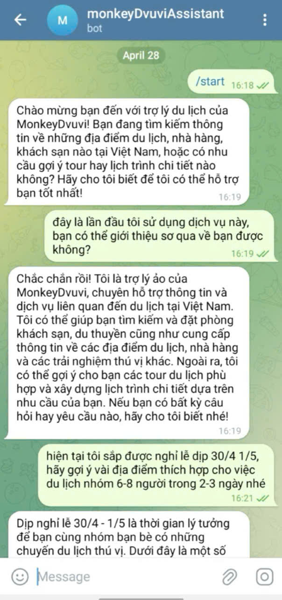
  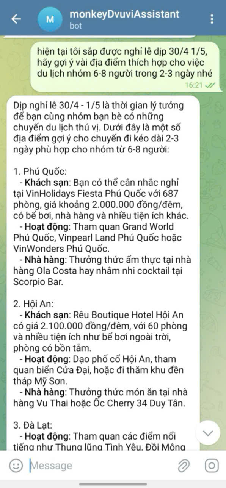
  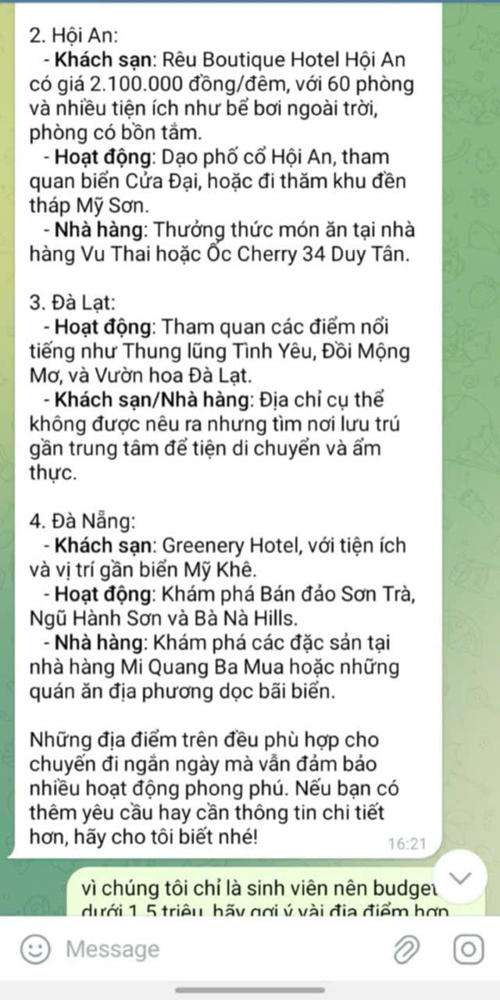
  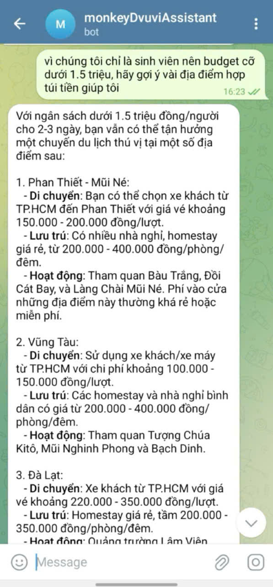
  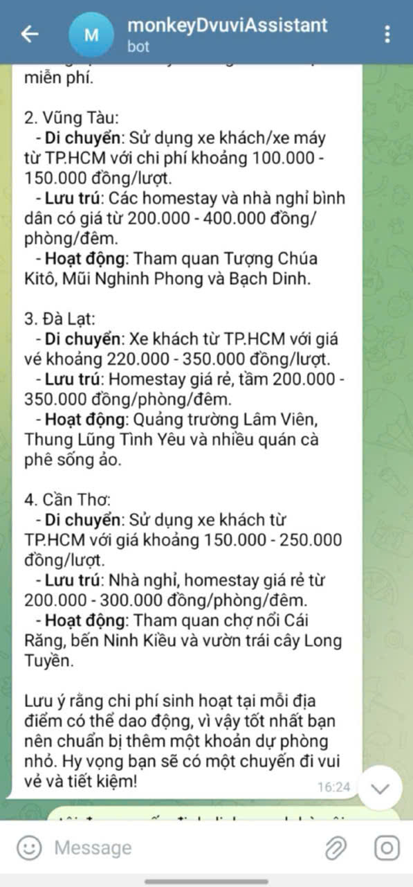
  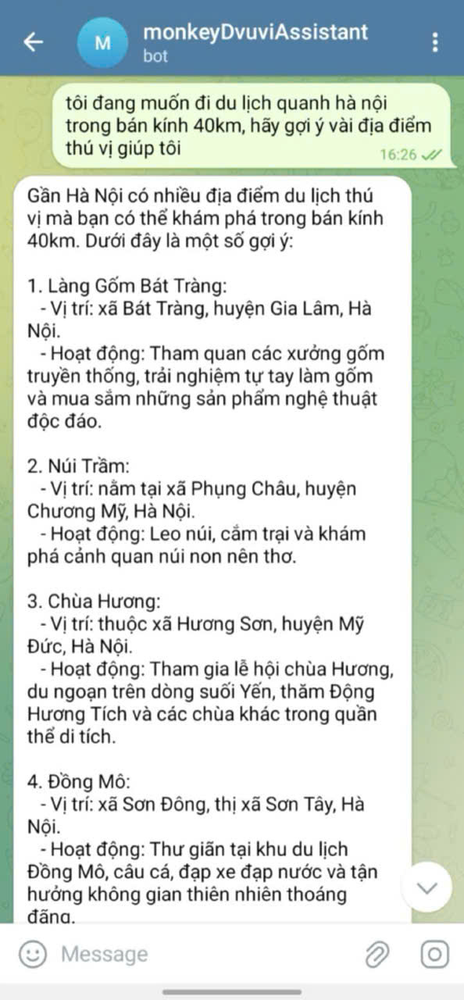
  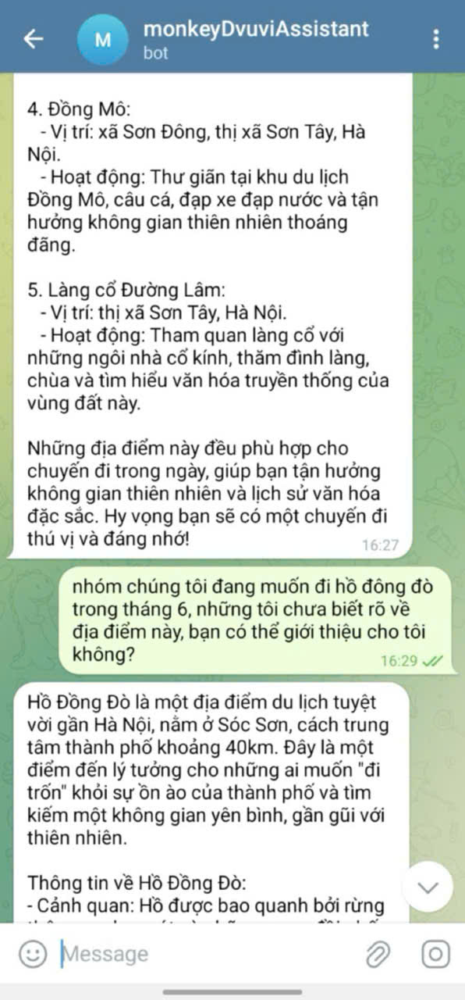
  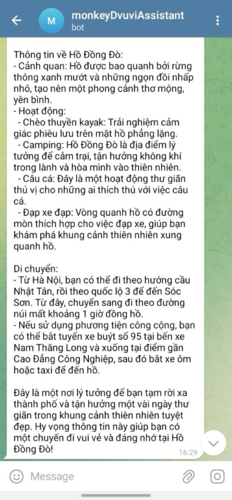
  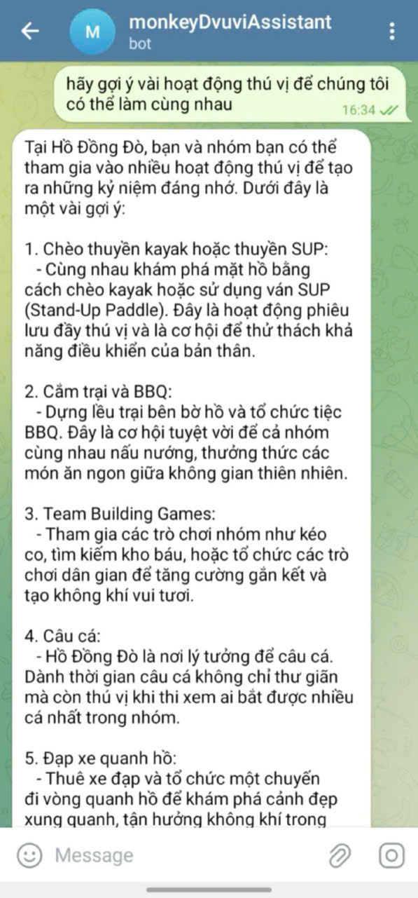
  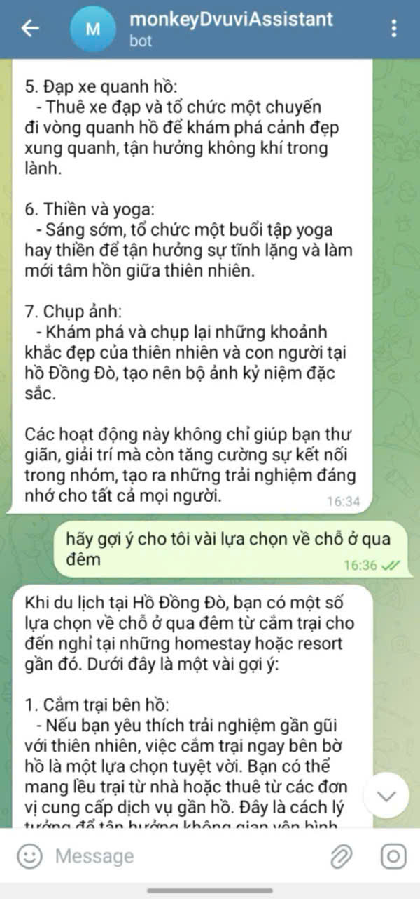
  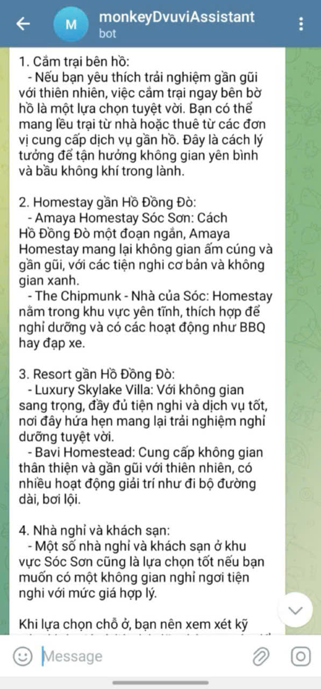
  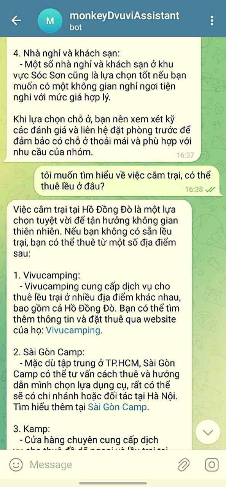
  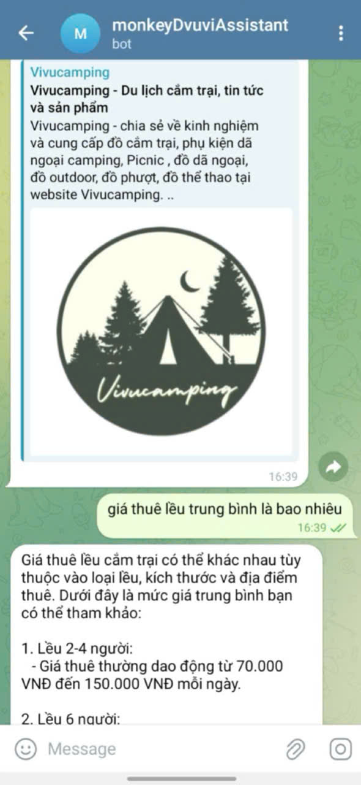
  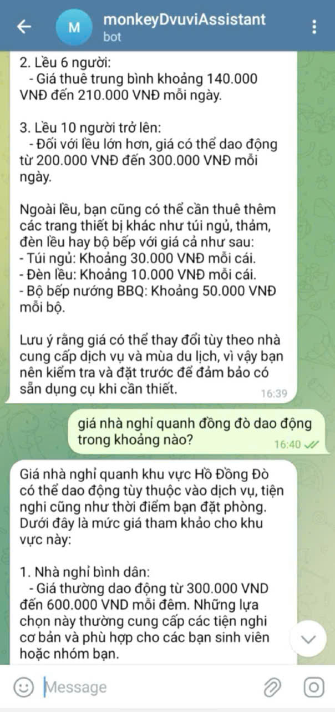
  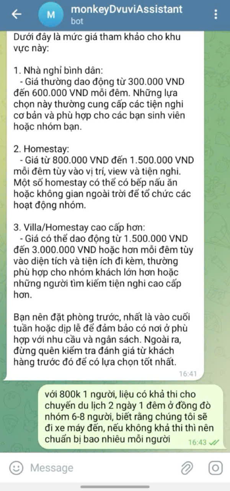

