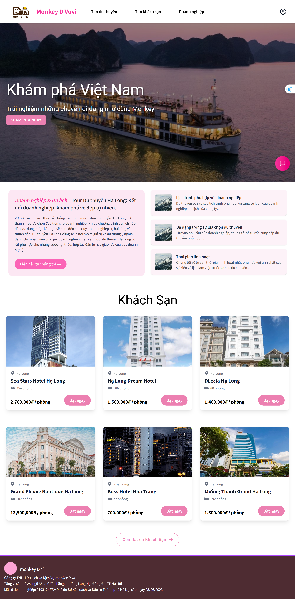
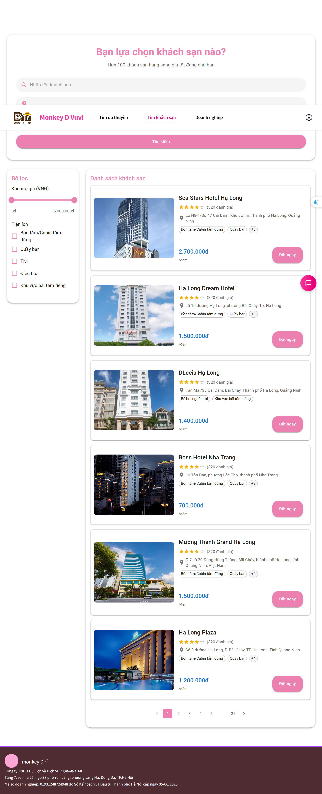
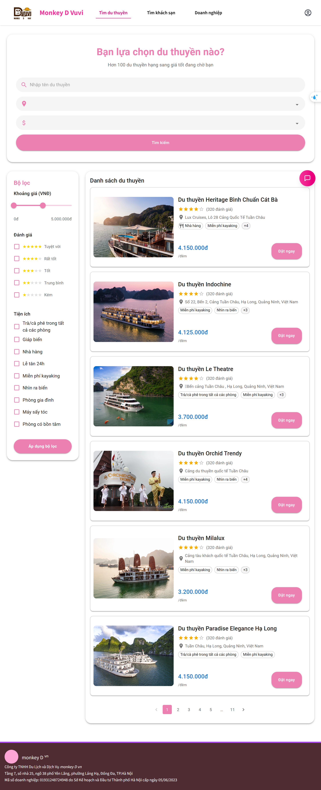
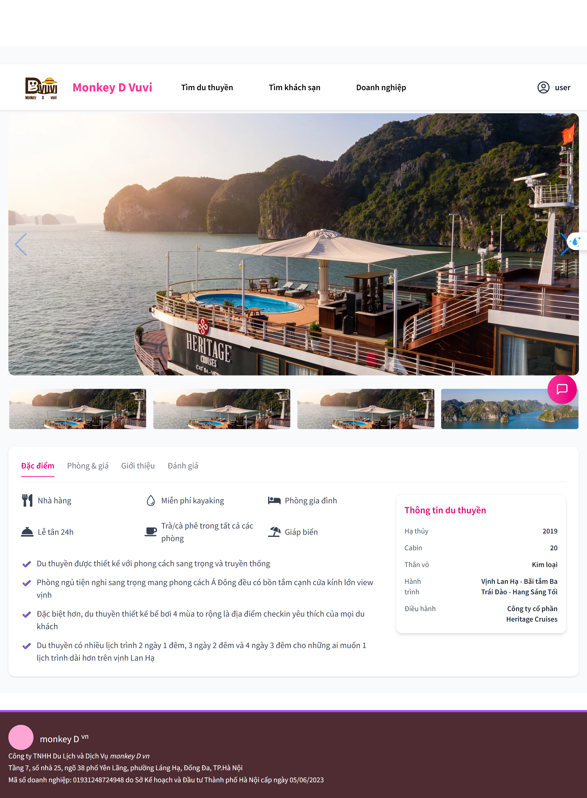
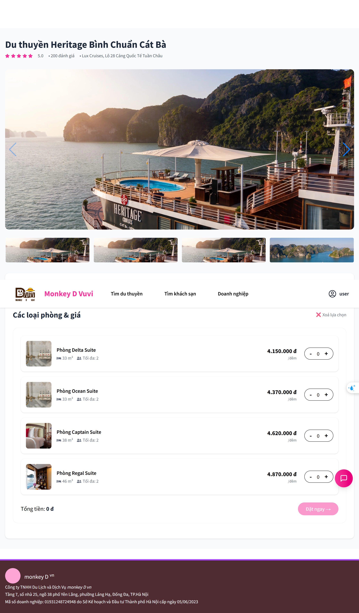
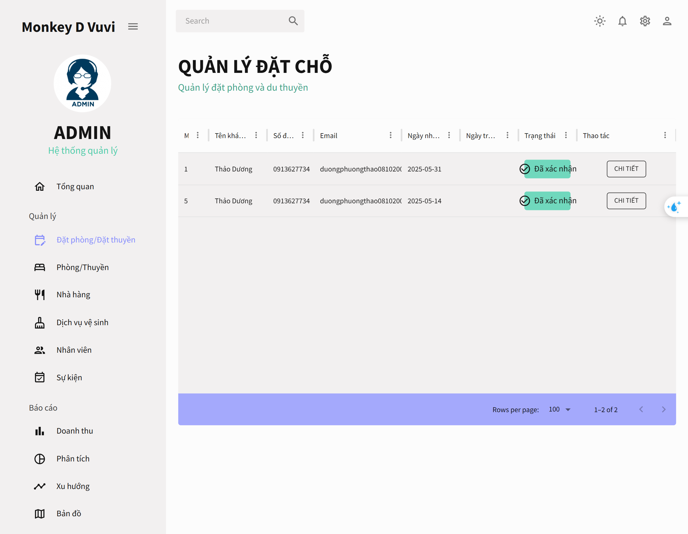
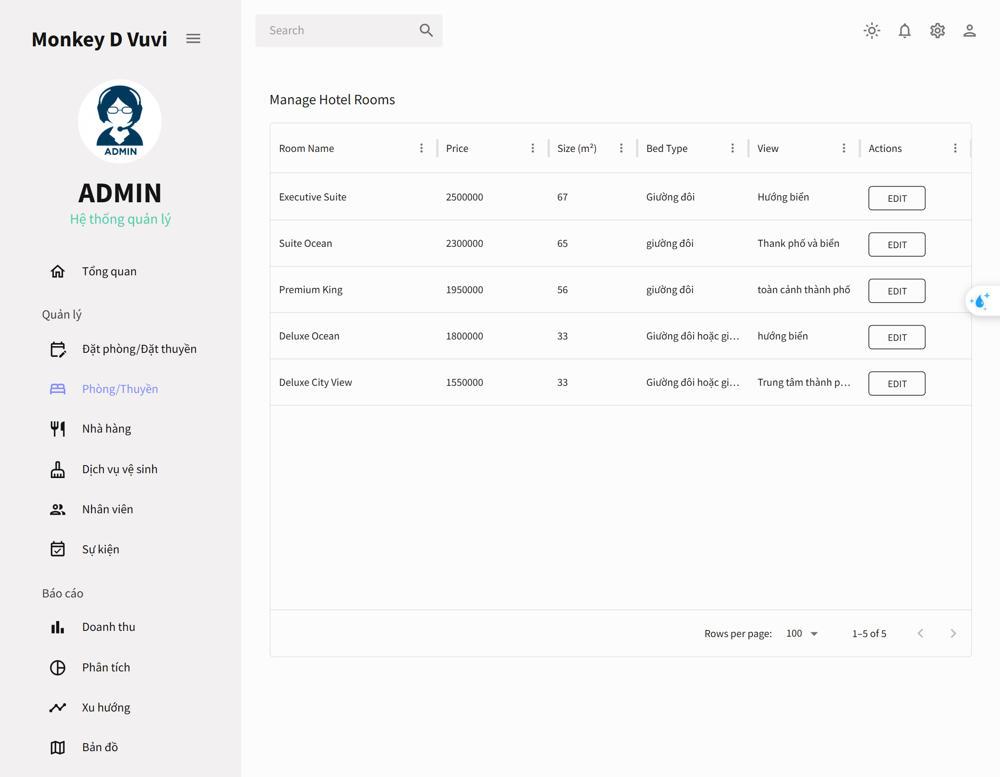
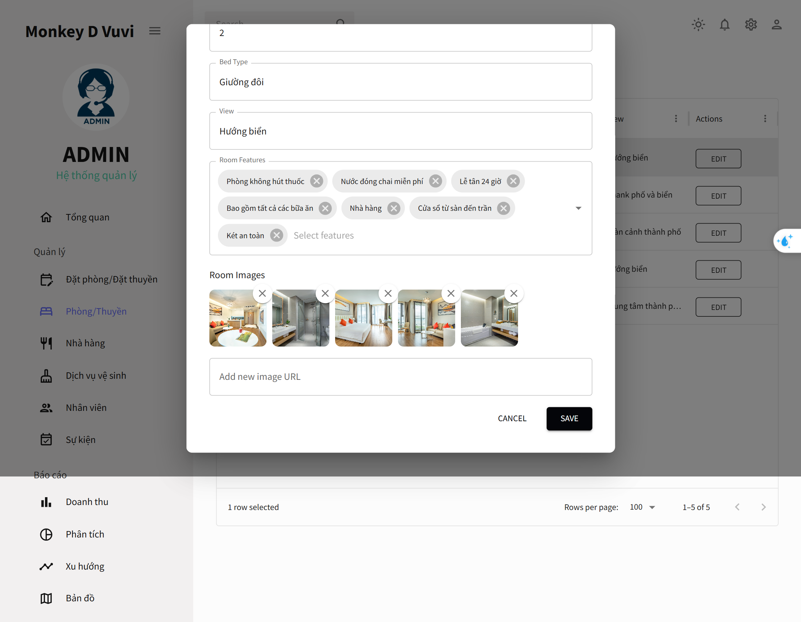
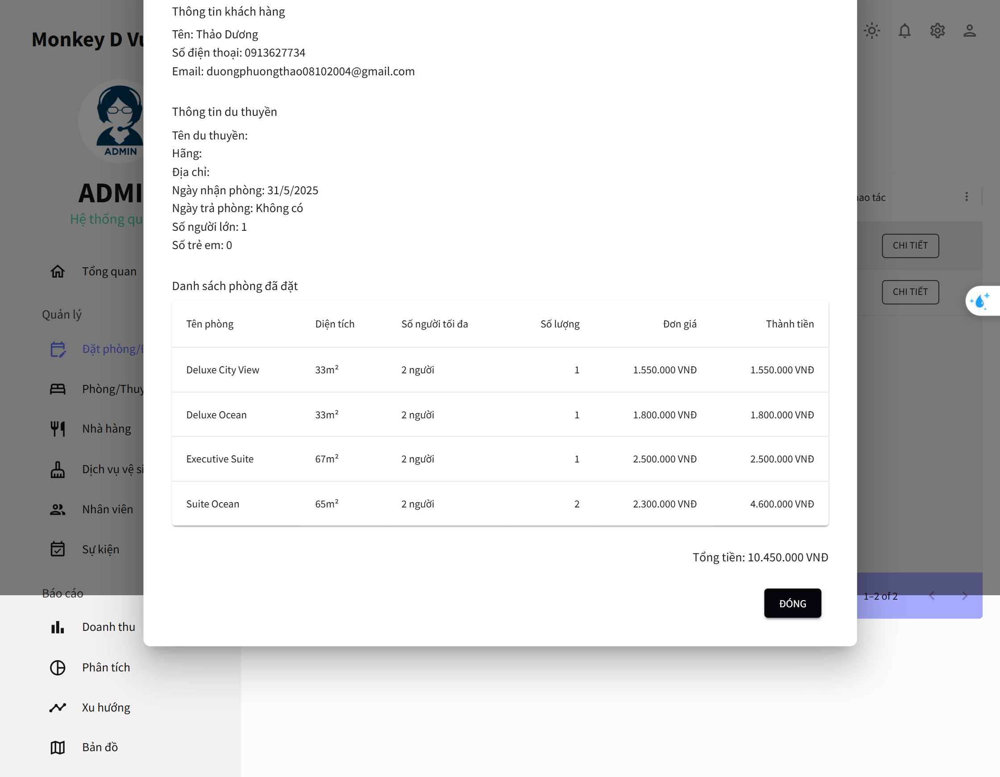

# 🐒D Luffy Website (Vietnam Travel & Culture Website)

## Introduction

Welcome to our Vietnam Travel & Culture website! This platform is designed to provide an immersive experience for users who want to explore the beauty of Vietnam, from breathtaking landscapes to rich cultural heritage. Our website offers travel guides and an easy-to-use booking system for yachts, hotels, and plane tickets to help visitors plan their trips efficiently.

This project is developed as part of the **Software Engineering** course at our university, following best practices in software development, teamwork, and project management.

## Features

- **User Authentication**: Sign up, log in, and manage user accounts.
- **Yacht, Hotel, and Plane Ticket Booking**: Users can search, book, and manage reservations.
- **Interactive Travel Guides**: Comprehensive travel information on different regions of Vietnam.
- **Image & Media Support**: Display images of destinations and accommodations.
- **User Engagement**: Review and rate hotels, yachts, and flights.
- **Responsive Design**: Optimized for mobile and desktop viewing.

## 📸 Demo Giao Diện

### 🏠 Trang Chủ



---

### 🔍 Trang Duyệt Khách Sạn

Cho phép người dùng tìm kiếm khách sạn theo địa điểm, giá, tiện nghi...



---

### ⛵ Trang Duyệt Du Thuyền

Giao diện tìm kiếm và lựa chọn các du thuyền theo lịch trình.



---

### 🏨 Trang Chi Tiết Khách Sạn / Du Thuyền

Hiển thị thông tin chi tiết của một khách sạn hoặc du thuyền.



---

### 🛏️ Danh Sách Phòng

Hiển thị danh sách các phòng khách sạn hiện có để người dùng lựa chọn.



---

### 📦 Quản Lý Đặt Phòng (Admin)

Cho phép quản trị viên xem và xử lý các đơn đặt phòng.



---

### 🏘️ Quản Lý Phòng (Admin)

Hiển thị danh sách các phòng, giúp admin tạo/sửa/xóa thông tin phòng.



---

### 🛏️ Chi Tiết Phòng (Admin)

Chi tiết từng phòng, bao gồm số lượng, loại phòng, giá cả...



---

### 📋 Chi Tiết Đặt Phòng (Admin)

Chi tiết từng đơn đặt chỗ của khách hàng.



## Tech Stack

- **Frontend**: React.js with Tailwind CSS for styling.
- **Backend**: Java Spring Boot (MVC architecture).
- **Database**: PostgreSQL for storing user data, bookings, and reviews.
- **Authentication**: JWT-based authentication for secure user login.

## Installation & Setup

### Prerequisites

Ensure you have the following installed:

- Node.js
- Java (JDK 17 or later)
- PostgreSQL

### Backend Setup

1. Clone the repository:
   ```sh
   git clone https://github.com/thao12345310/monkey-D-luffy.git
   cd monkey-D-luffy/backend
   ```
2. Configure PostgreSQL in `application.properties`:
   ```properties
   spring.datasource.url=jdbc:postgresql://localhost:5432/your_db_name
   spring.datasource.username=your_username
   spring.datasource.password=your_password
   ```
3. Run database migrations (if applicable):
   ```sh
   ./mvnw flyway:migrate
   ```
4. Build and run the backend:
   ```sh
   ./mvnw spring-boot:run
   ```

### Frontend Setup

1. Navigate to the frontend directory:
   ```sh
   cd ../frontend
   ```
2. Install dependencies:
   ```sh
   npm install
   ```
3. Start the development server:
   ```sh
   npm run dev
   ```

## Deployment

- Frontend: Deployed using Vercel/Netlify.
- Backend: Hosted on a cloud service like AWS, Render, or Railway.
- Database: Managed PostgreSQL instance.

## Contributors

This section outlines each group member’s contributions to the project. The team leader is indicated in **bold**.

| **Name**                  | **Student ID** | **Contributions** |
|---------------------------|----------------|--------------------|
| **Duong Phuong Thao**     | 20226001       | - Managed overall development process<br>- Designed ERD and Relational Schema<br>- Backend CRUD for company bookings<br>- Frontend for company dashboard<br>- Finalized report and slides |
| Hoang Khai Manh           | 20225984       | - Implemented authentication & authorization<br>- Backend CRUD for users & user bookings<br>- Docker packaging<br>- Participated in testing and reporting |
| Trinh Thi Thuy Duong      | 20226034       | - Researched and trained AI model<br>- Integrated Tavily / Google Search API<br>- Built LangGraph Agent<br>- Collected and preprocessed restaurant data<br>- Participated in testing and reporting |
| Nguyen Cong Duy           | 20215188       | - Crawled and preprocessed data<br>- Refined database schema<br>- Backend CRUD for hotels, cruises, rooms, companies<br>- Participated in testing and reporting |
| Doan Thi Thu Quyen        | 20226063       | - Frontend for hotel/cruise search pages<br>- Frontend for Home and Contact pages<br>- Designed page layout<br>- Participated in testing and reporting |
| Nguyen Thi Thu Huyen      | 20220073       | - Frontend for hotel/cruise detail pages<br>- Frontend for booking history page<br>- Prepared slides and presentation materials<br>- Participated in testing and reporting |

## License


## Contact

For any inquiries, please contact us at [duongphuongthao08102004@gmail.com].
